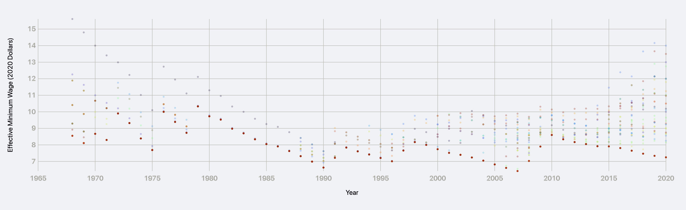
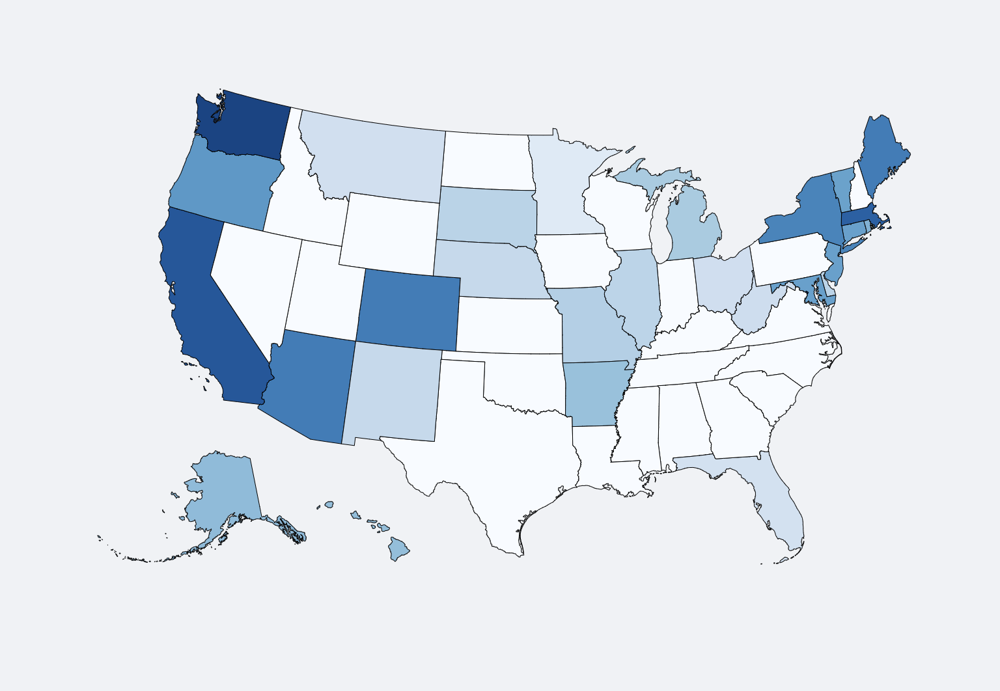
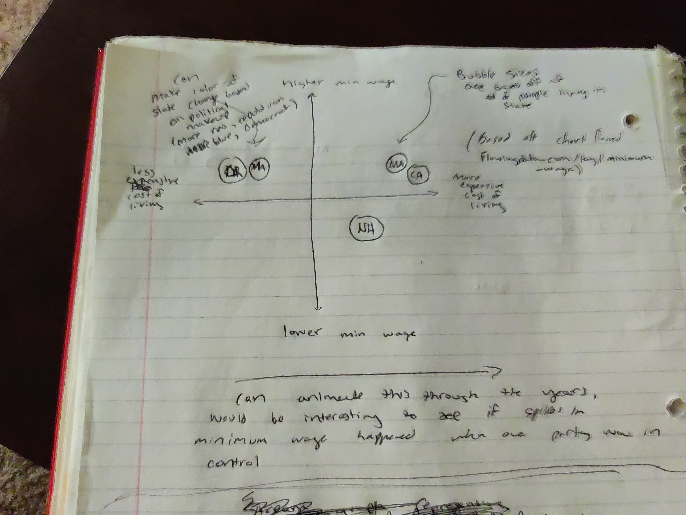

# Data Visualization Project

## Data

The data I will be using for my final data visualization project is regarding minimum wage information for the U.S states and territories over the past 50 or so years. All data I have currently found regarding this topic can be found [here](https://gist.github.com/apetit2/212a7cd715f8ba34eb637d014fffb12f). In the coming weeks, I'd like to find additional data that provides more information regarding cost of living, population size, political make-up, and other distinquishing factors amongst the people living in each of these areas. I believe it could prove a correlation between minimum wage and the aforementioned factors.

## Prototypes

I’ve created a few proof of concept visualizations of this data:

- The first visualization I created is a scatterplot. This chart, while pretty basic, does allow for users to update the x and y axes with any of the CSV columns that represent numerical data. The inital chart (the scatterplot shown on page load), for instance, plots effective minimum wage in today's dollars against year. There is also a color element to the chart that allows users to select any CSV column that represents string data. The chart will then utilize an ordinal scale that will map string values for the chosen column to a scatterplot point color. In the initial chart, the color maps to state values. 

- The second visualization I created is a geospatial chart. This chart maps effective minimum wage in today's dollars to a blue color gradient. Higher minimum wage values result in darker blues, while lower minimum wage values result in lighter blues. This color is then applied to each respective state on the U.S map. In addition, there is a slider that allows users to choose a particular year to view the data for.

## Questions & Tasks

The following tasks and questions will drive the visualization and interaction decisions for this project:

 * In which states has effective minimum wage decreased over the past 60 or so years? Has it decreased in any states? Has it increased in any states?
 * What are the states where minimum wage has kept up with inflation?
 * Is there any correlation between minimum wage and political identity of a state?
 * How has federal minimum wage changed over time?

## Sketches

The above image depicts a potential line graph that I could create for this project. Ideally, I'd have a drop down allowing a user to be able to choose between all U.S states/territories. When a state is selected, the chart would update with a line graph depicting that state's effective minimum wage over time. I'd also want to provide a second line showing the effective minimum wage at the federal level as a direct comparison. Would want to also provide a tooltip to provide specific information about the minimum wage for the given year (sometimes it's difficult to make out exact value, and the tooltip should help to provide this info more easily).

The above sketch is very similar to the first single state line graph, but this one will provide additional line graphs for each of the states as an easy comparison between all. Similar interactions will be made here as well, where a tooltip will be provided that shows specific minimum wage info for each of the trend lines. An alternative to creating this chart might be to add an additional level of interaction to the singl state line graph, where a user can choose which states' trend lines they want to show, and mix/match accordingly.

The sketch above depicts a potential interactive scatter plot that I could create for this data. The X axis represents cost of living, and the y axis represents minimum wage for a given year. Each data point represents a state or territory. Potential interaction for the graph could include an automatic update feature, where every half second or so the data updates to represent a new year (years would go up sequentially). Could also make the circle color of each data point indicate political make-up of a state for the given year (more blue represents more registered democrats, more red represents more registered republics, more white represents more independents/3rd party). Size of the circle could represent population.

The sketch above depicts a potential interactive geospatial chart I could create for this data. The color gradient or each state could represent minimum wage - where darker blues represent higher min. wage values, and lighter blues represent lower min. wage values. Clicking on each state could provide more information about the state (actual min. wage values, number of registered democrats, number of registered republicans, number of people, etc.). Could provide filters to filter out states that have a min. wage set to the federal min. wage, and vice versa.

## Open Questions

My biggest concerns for this project are finding open source data that pertains to my questions. To get the initial dataset, it took me a decent amount of time searching through kaggle and other sources, and I imagine it might be even harder now that I have locked in a specific dataset. 
