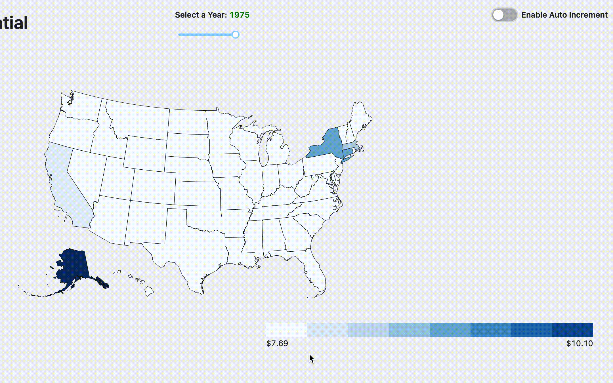
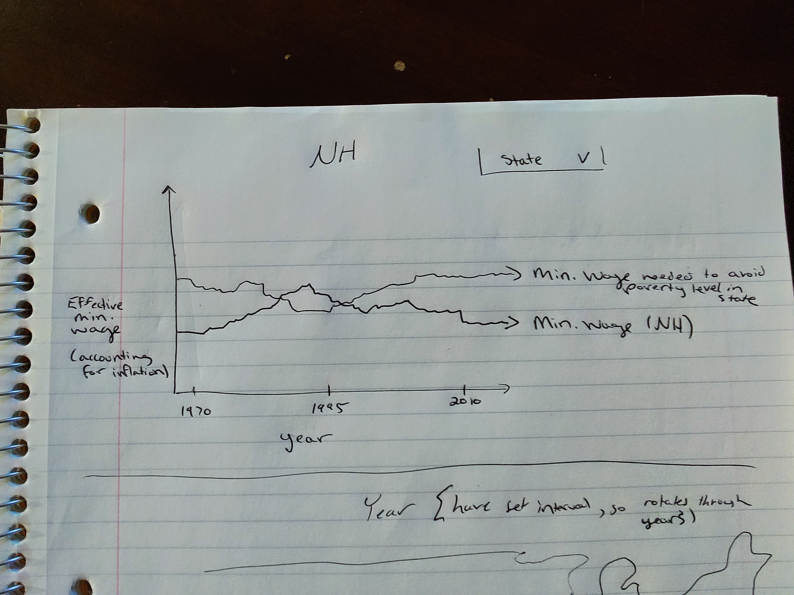
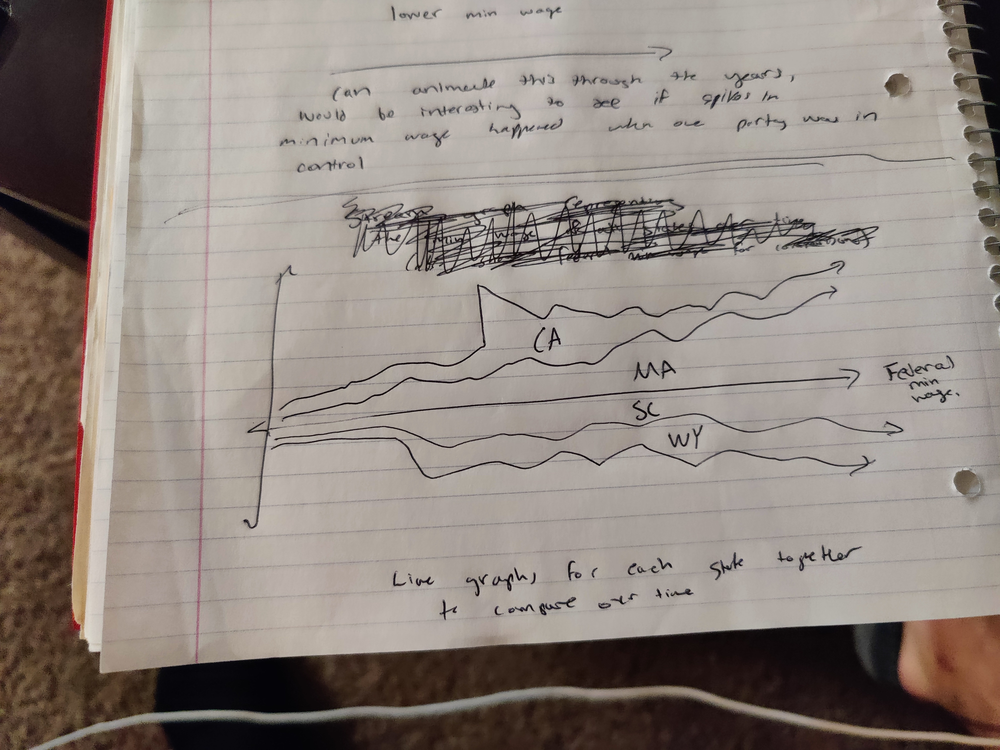
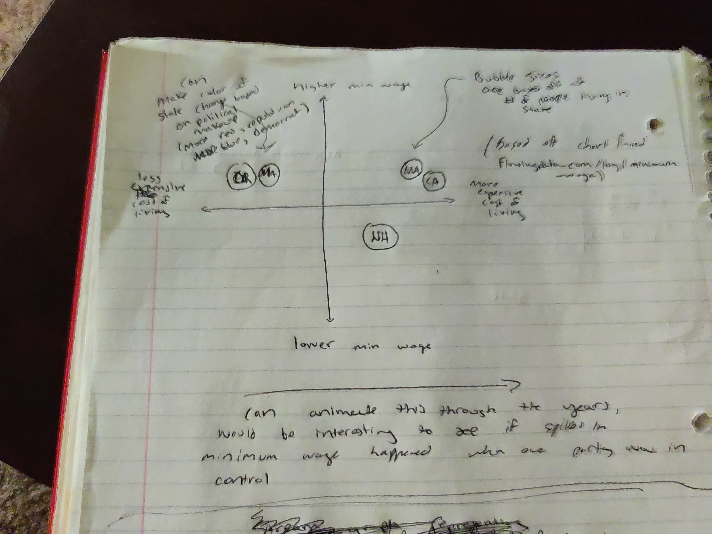
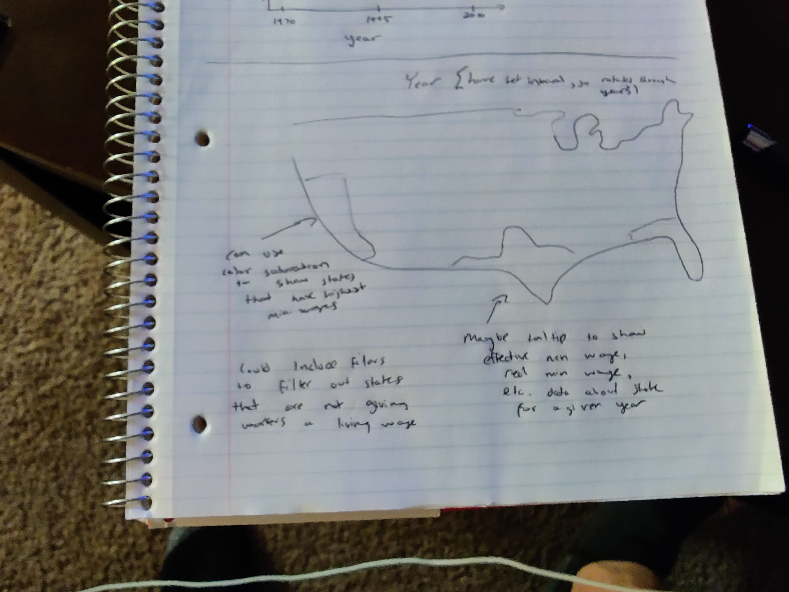

# Data Visualization Project

## Data

For my final data visualization project, I will be presenting information on minimum wage and cost of living throughout the United States. Currently, I have one formatted dataset that provides minimum wage data for all 50 states as well as the 5 U.S owned territories since 1968. This dataset can be found [here](https://gist.github.com/apetit2/212a7cd715f8ba34eb637d014fffb12f). In addition, I have located additional data from the U.S Housing and Urban Development Department that provides average rent costs since the early 2000s. This data is provided free of charge at this [location](https://www.huduser.gov/portal/datasets/50per.html#null). This dataset can be found [here](https://gist.github.com/apetit2/aaa39169ab48ff313cfb2bfe12486fef).
---

## Prototypes
As an initial POC, I have created a few visualizations to help demonstrate the direction I hope to take this project.

Links:
* [Geospatial Chart](https://apetit2.github.io/cs573-load-data/#/minimum-wage/geospatial/iterated)
* [Line Chart](https://apetit2.github.io/cs573-load-data/#/minimum-wage/line-chart)
* [Scatter Plot](https://apetit2.github.io/cs573-load-data/#/minimum-wage/scatter-plot)

### Min. Wage Geospatial Chart
Since I am comparing minimum wage values throughout the country, I thought it would make sense to produce a geospatial chart that easily compares highest and lowest minimum wages for a given year. I have used color saturation to distinguish states with higher minimum wage (intenser shades of blue) from those with lower minimum wages (less intense shades of blue). I also opted to include a slider to show minimum wage trends throughout the years (1968-2020). Because of this inclusion, however, I chose to represent all dollar amounts shown in 2020 dollars. This makes it a bit more accurate to compare data between multiple years since inflation has consistently trended upwards and would skewer results otherwise. To further highlight minimum wage trends by year, I included an auto increment switch. When toggled on, the visualization will increment by year every half second. Lastly, because color isn't great at representing distinct quantitative data, I have included a tooltip to show the exact effective minimum wage for each state. This tooltip will show when hovering over any state on the map. Clicking on any state will bring up specific data to that chart formatted in a line chart. A gif showing off the visualizations capabilities is included below.

*figure 1: Minimum Wage Geospatial Chart*

### Min. Wage Line Chart
Another prototype I created for this project is a highly configurable line chart that can be used to show minimum wage rates for each distinctive state or all collectively. This chart has additional menu drop downs for choosing how lines are grouped, what data is mapped as an x value, and what data is mapped as a y value. With this being said, however, the most reasonable selections are probably the defaults, whereas the x axis represents year, the y axis represents effective minimum wage in 2020 dollars, and the grouping represents state. Future modifications will likely remove these superfluous elements, and, in addition, add a legend, a tooltip, and a comparison line (ie. federal minimum wage through the years) to this chart. 
*figure 2: Minimum Wage Line Chart*

### Min. Wage vs. Rent Cost Scatter Plot
Another prototype I created for this project is a highly configurable scatter plot that can be used to show minimum wage rates for each distinctive state as it pertains to rent costs for that state. Currently there is a slider that can be used to cycle through years: 2001-2020. Like the geospatial chart prototype, the year can be auto incremented by toggling on the auto-increment switch. Moreover, a tooltip provides additional information by hovering over a circle in the chart (each circle represents a unique territory or state). Future modifications will add an additional menu item to choose between rent types (ie. studio, 1BR apartment, 2BR apartment, 3BR apartment, and 4BR apartments). I will also attempt to include additional context on other living expenses for a state. 
*figure 3: Minimum Wage VS. Rent Cost Scatter Plot*

---

## Questions & Tasks
 * In which states has effective minimum wage decreased over the past 60 or so years? Has it decreased in any states? Has it increased in any states? Has it remained stagnant?
 * Which states, if any, have increased minimum wage to meet increases in inflation?
 * Is minimum wage for a given state enough to meet the living costs associated with that state?
 * Is there a correlation between higher wages and higher costs of living?

 ---

## Sketches

### Line Chart
*figure 4: Simple Line Chart Sketch*

*figure 5: Multi-Line Chart Sketch*

The above sketches, highlight two line chart views that I will create for this project. In the *Simple Line Chart Sketch*, a single state will be filtered out and compared with the federal minimum wage through the years. In the *Multi-Line Chart Sketch* all states will be compared to show any interesting trends and outliers. Both graphs, will have tooltips to show more specific information at given data points. 

### Scatter Plot

*figure 6: Scatter Plot Sketch*

The above sketch, depicts a potential interactive scatter plot that I will look to create that combines data taken from the Kaggle dataset and the ones found on the HUD's website. Here, the X axis represents cost of living, and the y axis represents minimum wage for a given year. Each data point represents a state or territory. Potential interaction for the graph could include an automatic update feature, where every half second or so the data updates to represent a new year (years would go up sequentially). Size of the circle could represent population.

### Geospatial Chart

*figure 7: Geospatial Chart*

The above sketch depicts the initial sketch up of the geospatial chart I have since created (figure 1). 

---

### Interactions
* Geospatial Chart will include:
  * Tooltips when hovering over states
  * Toggle switch to auto increment years
  * Slider to manually choose which year displays
  * Pressing on state navigates to line chart for selected state
* Line Chart(s) will include
  * Tooltips when hovering over lines
  * Drop down to toggle between different states
  * Some additional filtering (possibly to hide/show federal minimum wage line)
* Scatter Plot will include
  * Tooltips when hovering over circle (state representation)
  * Toggle switch to auto increment years

--- 

### Schedule of Deliverables

* Week of October 13th:
  * Finalize geospatial chart (10/12)
    * Clean up title, description, and any lingering bugs
  * Refactor existing code base to be cleaner and easier to follow (10/12)
    * Include comments where applicable
    * Ensure all existing charts, graphs, plots, etc. are reusable
  * Begin parsing and formatting HUD datasets (10/16)
    * The HUD divvies up their average rent information into CSV files by year.
    * They also record average rent for each county in the United States.
    * To process, going to need to fetch every CSV file, find the average rent price per state from the list of counties, and then combine all average rent prices per state by year into a single CSV file.
* Week of October 20th:
  * Finish any remaining data formatting for the HUD datasets (10/18)
    * Create a new gist to host the parsed and formatted CSV
    * Load the CSV into my existing D3/React project
  * Perform any needed updates to the existing line chart (10/19)
    * Add interactions (ie. tooltip)
    * Add Legend
    * Clean up title, description, and any lingering bugs
  * Begin work on Minimum Wage V. Cost of Living scatter plot (10/23)
    * Could make use of my existing scatter plot component
    * If making use of this scatter plot, need to ensure that the HUD dataset is combined with the Kaggle dataset
* Week of (10/27)
  * Finish any remaining work on the Minimum Wage V. Cost of Living scatter plot (10/25)
  * Begin work on adding animations to charts (10/30)
    * Using react's virtual DOM to render svg's makes it difficult to make use of d3 built-in animations
    * Could use react-move, or react-motion, but both require some additional optimization on some of the charts I made to prevent unnecessary re-renders
* Week of (11/3)
  * Finish work on animations (11/3)
  * Code clean up (11/5)
  * Text clean up (11/5)
* Week of (11/10)
  * Unit Tests (11/13)
* Week of (11/17)
  * Work on any remaining tasks that weren't finished in above time line (11/20)
* Week of (11/24)
  * Work on any remaining tasks that weren't finished in above time line (11/27)

  